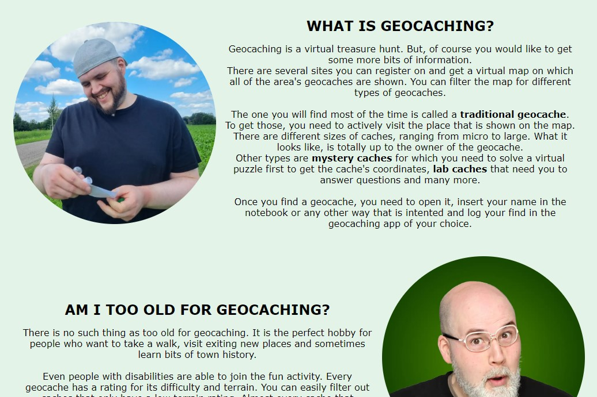
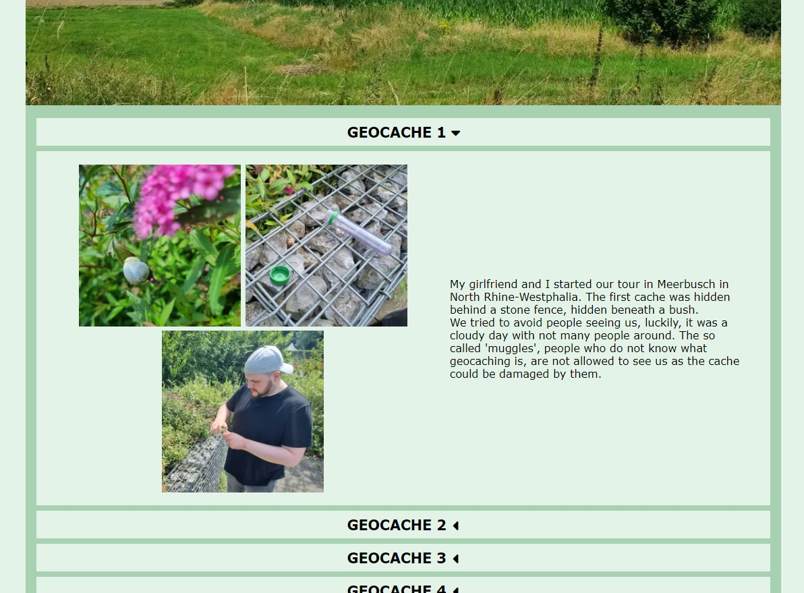
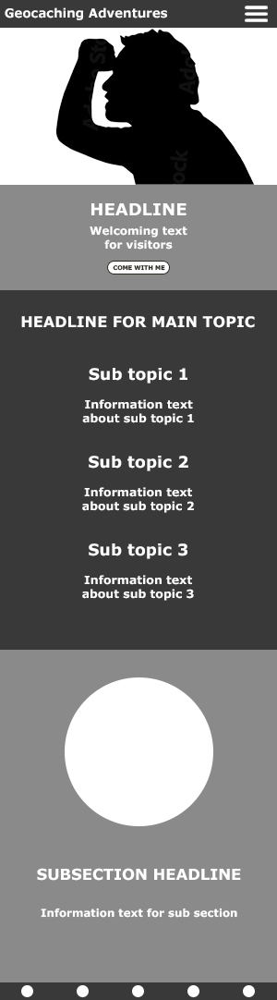
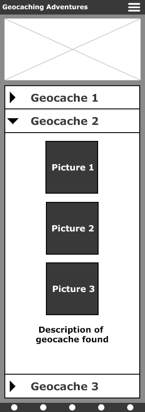
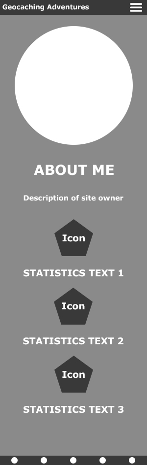
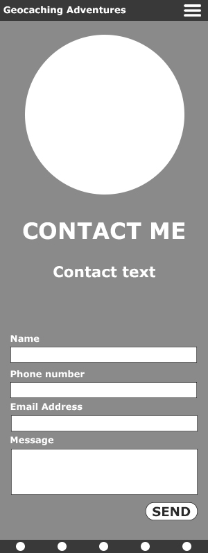
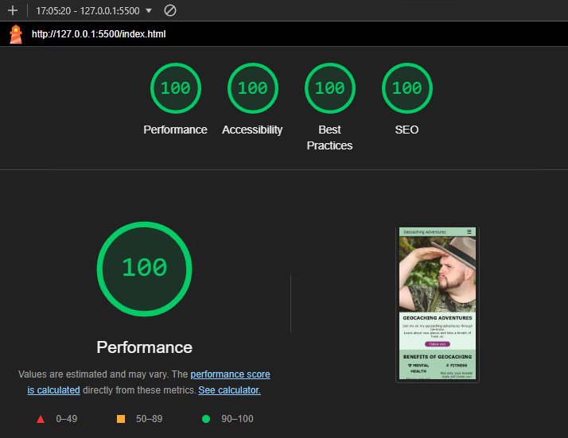
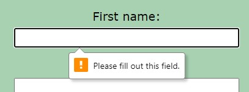
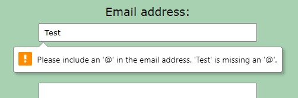

# Geocaching Adventures
Geocaching Adventures is a homepage about one of Dominik Wulf's favourite hobbies. On this page, he shares some pieces of information about the activity and his adventures. The site features four pages.

The live page can be viewed here: [Link to Geocaching Adventures](https://ci-dominik.github.io/pp1-geocaching/index.html "Link to the live website")

## **TABLE OF CONTENTS**

[**USER EXPERIENCE**](#user-experience)
  * [Target audience](#target-audience)
  * [User's journey](#users-journey)
  * [Intuitive and consistent design](#intuitive-and-consistent-design)
    
 

[**FEATURES**](#features)
  * [Site-wide](#site-wide)
    * [Navigation menu](#navigation-menu)
    * [Footer](#footer)
    * [Favicons](#favicons)
    * [Contact success page](#contact-success-page)
    * [404 page](#404-page)
  * [Landing page](#landing-page)
    * [Hero section](#hero-section)
    * [Benefits section](#benefits-section)
    * [Geocaching explanation](#geocaching-explanation)
  * [About page](#about-page)
    * [Author information](#author-information)
    * [Geocaching statistics](#geocaching-statistics)
    * [Fun facts](#fun-facts)
  * [Adventures page](#adventures-page)
    * [Introduction and sample adventures](#introduction-and-sample-adventures)
  * [Contact page](#contact-page)
    * [Contact text and form](#contact-text-and-form)

 

[**FEATURES EXPLAINED**](#features-explained)
  * [Existing](#existing)
    * [Responsive design](#responsive-design)
    * [Interactive dropdown buttons on adventure page](#interactive-dropdown-buttons-on-adventure-page)
    * [Contact form to submit a message](#contact-form-to-submit-a-message)
  * [Upcoming](#upcoming)
    * [Connection to a database](#connection-to-a-database)
    * [Auto-adjusting counter](#auto-adjusting-counters)
    
 

[**DESIGN**](#design)
  * [Colour choice](#colour-choice)
  * [Wireframes](#wireframes)
    * [Landing page](#landing-page)
    * [Adventures page](#adventures-page-1)
    * [About page](#about-page-1)
    * [Contact page](#contact-page-1)
    
 

[**TECHNOLOGIES**](#technologies)
  * [HTML](#html)
  * [CSS](#css)
  * [JavaScript](#javascript)
  * [Visual Studio Code](#visual-studio-code)
  * [GitHub](#github)
  * [Adobe Photoshop](#adobe-photoshop)
  * [Fontawesome](#fontawesome)
  * [Favicon generator](#favicon-generator)
    
 

[**TESTING**](#testing)
  * [Responsiveness](#responsiveness)
  * [Used platforms and devices](#used-platforms-and-devices)
  * [Bugs](#bugs)
    
 

[**ACCESSIBILTIY**](#accessibility)
  * [Lighthouse testing](#lighthouse-testing)
  * [WAVE extension](#wave-extension)
  * [Use of font sizes](#use-of-font-sizes)
  * [Goal of accessibility measures](#goal-of-accessibility-measures)
    
 

[**FUNCTIONAL TESTING**](#functional-testing)
  * [Navigation links](#navigation-links)
  * [Contact form](#contact-form)
    
 

[**VALIDATOR TESTING**](#validator-testing)
  * [HTML validator](#html-validator)
  * [CSS validator](#css-validator)
  * [JavaScript validator](#javascript-validator)
    
 

[**DEPLOYMENT**](#deployment)
  * [Visual Studio Code connection](#visual-studio-code-connection)
  * [Cloning, commitig and pushing via Visual Studio Code](#cloning-commiting-and-pushing-via-visual-studio-code)
  * [Deployment via GitHub Pages](#deployment-via-github-pages)
    
 

[**CREDITS**](#credits)
  * [PicturePeople Leverkusen](#picturepeople-leverkusen-photo-studio)
  * [Fontawesome](#fontawesome-1)
  * [Techsini](#techsini)
  * [YouTube](#youtube)
  * [Pixabay](#pixabay)
  * [Pexels](#pexels)

## **USER EXPERIENCE**

## Target audience
* Everyone should have the same experience when visiting the website, people who know geocaching and those who do not. The target audience is for people of all ages and ethnicities as this hobby can be picked up by anybody. But especially people who rarely visit nature should be encouraged to get outside and increase their mental and physical health.

## User's journey
* The user should be welcomed by the frontpage, directly portraying the adventures spirit and maybe even have a laugh because of the photo.
They should also directly see that there is more to the website by teasing the content below the hero image which states the advantages of geocaching. 
Once the user has an overview of the content, a distinctly coloured button leads them to the adventures one can go on. They should also be able to navigate
to any other part of the homepage if they have questions for the site owner or want to know more about him. 

## Intuitive and consistent design
* All pages share the same design and color scheme. In addition to that, the clear divided sections should display a shift in the content.

---

## **FEATURES**

## Site-wide

### Navigation menu
* The navigation menu was designed to attract the users to the adventures page. They should get there as soon as possible to experience the main area of the homepage in which I show photos of two sample adventures and of geocaches I found along the way. There is also an indicator on which page the user is currently at. The selected item is underlined.
In mobile view (width < 48rem), the navigation becomes a burger menu that is collapsible to reveal the hyperlinks. It was created using a self written JavaScript file.

 

 

### Footer
* The footer consists of social media links to LinkedIn, Facebook, X, Instagram and Pinterest. All of those links got an aria label to increase the accessibility for impaired users. Also, every link has a rel attribute of "noopener" to prevent security problems.

 

### Favicons
* As a favicon, the geocaching logo was used so the user immediately gets the right impression of the content. Icons in different sizes were added to display an icon for every use case. For example as the tab's icon or when the page gets saved as a link on a mobile device.

 

 

### Contact success page
* A page dedicated to inform the user of a successful form transmission was added. It leads the visitor back to the frontpage after a delay of five seconds.

 

### 404 page
* A 404 page was added to inform the user when a page cannot be found. It also features the navigation and footer bar to lead the user back to another page of the site.

 

---

## Landing page

### Hero section
* The hero section of the homepage is meant to attract the user's attention. A picture of Dominik Wulf is shown on the right side. He is wearing a safari outfit to set the theme and mood for adventures and create something to laugh at. 
An additional information section describes the content the user will see on the page. A call to action button is placed to immediately lead the user to the adventures site.

 

### Benefits section
* Just below the hero section lies a list of benefits geocaching provides to encourage people to also pick up the hobby and increase their health. 
A fracture of the content is already shown in the initial site view as a spoiler to imply that more content awaits on the frontpage.

 

### Geocaching explanation
* In this section, the user can gather additional pieces of information about the activity. Also, they should get an insight if it is the right hobby for them as well. Some convincing facts should lead the user to starting the geocaching journey.

 

---

## About page

### Author information
* A photo displaying Dominik Wulf holding a geocaching items for comedic effect and a text describing him as a person. In addition to the general geocaching infos, the user should get an impresson of the site owner's personal life to strenghten the human bond.

 

### Geocaching statistics
* An overview of Dominik Wulf's personal adventure statistics, showing the total tours, found geocaches and missed geocaches. This way, the user gets a brief overview of the scale of the hobby and time spent.

 

### Fun facts
* Some fun facts about the site owner as an entertaining addition.

 

---

## Adventures page

### Introduction and sample adventures
* The user gets welcomed on the adventure page and is offered to join in on the taken adventures listed further down below. There, two sample adventures were added to give a taste of the hobby. Every dropdown menu can be expanded to reveal further details. The attached arrow rotates by 90 degree once the button is clicked.

 

---

## Contact page

### Contact text and form
* A welcoming picture and a text are placed to lead the user to getting in touch with the site owner. 
A form to insert some personal data is presented to each visitor.
  * First name is a required text input
  * Last name is a required text input
  * Email address is a required email input to get in touch with the user
  * The personal message is a required textarea for submitting a message
  * The send button is used to send the data to contact-success.html

 

---

## **FEATURES EXPLAINED**

## Existing

### Responsive design
* The homepage should behave responsive on any kind of device, ranging from smartphones to desktop browers. Everything was tested using Google Chrome's developer tools.

### Interactive dropdown buttons on adventure page
* On the adventure page, it is possible to open up dropdown menus for every found geocache. Those menus are implemented using JavaScript.

### Contact form to submit a message
* A contact form for transmitting user messages is added to let the visitor get in touch with Dominik Wulf should they have questions or suggestions for improvement.

## Upcoming

### Connection to a database
* It is planned to implement a database system to store taken adventures and found geocaches. This way, they can get extracted from the backend to dynamically display updated content on the adventure page.

### Auto-adjusting counters
* In addition to the stored data of adventures, a database should contain the amounts to found and missed geocaches and the number of adventures taken.

---

## **DESIGN**

## Colour choice
* In the early stages of the development, saturated green colours were used to set a mood for jungle adventures. This was later on revisited to pastel colours to increase the accessibility and overall tone of the homepage. The chosen mint colour should express more calmness and was used to welcome the user. 
The violet tone was supposed to paint a clear contrast to call the user to action.

 

## Wireframes

### Landing page

 

### Adventures page

 

### About page

 

### Contact page

 

---

## **TECHNOLOGIES**

### HTML
* HTML (HyperText Markup Language) was used to create the structure of the homepage.

### CSS
* All styled were applied by using and linking a CSS (Cascading Style Sheet) file.

### JavaScript
* JavaScript was used to create the navigation menu and the adventure dropdown buttons.

### Visual Studio Code
* Visual Studio Code was used to clone the GitHub repository, edit the homepage's code and commit / push the results to GitHub.

### GitHub
* GitHub was used to store the homepage's files. Everything was deployed using GitHub Pages.

### Adobe Photoshop
* Adobe Photoshop was used to create content images and wireframes.

### Fontawesome
* Fontawesome was linked in the homepage's code to include icon files.

---

## **TESTING**

## Responsiveness

|Testing method | Expected result | Actual result |
|:-------------:|:---------------:|:-------------:|
| Resizing the browser window    | Navigation menu should trigger and elements should shift     | Expected results were achieved   |
| Opening Google Chrome's developer tools and changing the size of the frame | The design should shift up to a width of around 250px | Expected results were achieved |
| Visiting the homepage on own smartphone | Only the mobile view should be present, in landscape and portrait mode | Expected results were achieved |
| Sending the homepage link to friends and family | The same experience should occur on any of the testing devices | Expected results were achieved |

## Used platforms and devices

### Browsers
* Google Chrome
* Mozilla Firefox
* Microsoft Edge

### Smartphones
* Poco F5 Pro
* Samsung S21
* Samsung S23

## Bugs

### Unfixed bugs
* In Mozilla Firefox, when shrinking down the browser size, the hero information section gets too narrow. In the futures, this needs to be addressed as the site owner was not able to fix this issue at the moment of final deployment.

 

### Fixed bugs
* The performance of the adventure page was lacking. This was fixed using the loading="lazy" proberty on the hidden images.

 

---

## **ACCESSIBILITY**

### Lighthouse testing
* Lighthouse testing was used to determine the site's performance, accessibility, best practices and SEO. Special emphasis was layed on performance and accessibility to provide a great user experience for every visitor, no matter the device or conditions. 

**Frontpage**

  

**Adventures**

  

* The mobile adventures page suffered from performance issues. This was partially fixed in the end stage of the homepage.

 

**About me**

  

**Contact**

  

**Contact success**

  

**404 page**

  

### WAVE extension
* The WAVE extension in Google Chrome was used to spot errors in page design. It detected a click event that is only present on desktop versions. This should be no issue as it is only used when a cursor is used anyways. 
The only other issue was a redundant link to the frontpage in the logo and the navigation bar. As it is common practice to use this approach to web design, I did not address this issue any further. 
The WAVE extension correctly spotted the aria labels that were used for the footer's social media icons. The links also got the rel attribute of noopener to increase website security.

### Use of font sizes
* Throughout the whole homepage, every element was sized using the rem unit. This way, it is ensured that the experience is the same on any font size setting of the browser. The unit was used to give people who cannot read small texts a better time and feel included.

### Goal of accessibility measures

* Everyone should be able to enjoy the website content, so an alt tag was added to every picture to describe it. 
In addition to this, aria labels were added to social media links to describe their behaviour. It is also mentioned that those open in a new tab. 
This way, every screen reader should be able to pick of the provided content. 
Lastly, the colours of the homepage were chosen to ensure enough contrast for visually impaired users.

---

## **Functional testing**

### Navigation links
* The navigation menu should be visible and usable on every page on any device. I tested every part of it on multiple devices and resolutions.

|Testing method | Expected result | Actual result |
|:-------------:|:---------------:|:-------------:|
| Visit every page to see if navigation works on all of them | Navigation menu should be present on all sites, even 404 and contact success | Expected results were achieved   |
| Click on every link in the navigation menu to reach other pages | Links should be clickable and send me to the desired page | Expected results were achieved |

### Contact form
* The contact form should only be sendable once every piece of information is entered correctly. Afterwards, the user should be sent to a success page.

|Testing method | Expected result | Actual result |
|:-------------:|:---------------:|:-------------:|
| Try to submit the form without any data put in | The text fields should print an error that every one of them needs to be filled out | Expected results were achieved |
| Try to submit the form with only a text written in the email input element | An error should occur, telling that the email format needs to be used | Expected results were achieved |
| Entering data and submitting the form correctly | The user should be send to the success page | Expected results were achieved |

---

## **Validator testing**

### HTML validator
* All pages were checked for their HTML structure by the W3C Markup Validation Service. No document showed any errors.

 

### CSS validator
* The stylesheet file was checked via the W3C CSS Validation Service. No errors were found.

 

### JavaScript validator
* The scripts.js file was checked for correct use of the programming language. One alert mentioning that openDropdown() is unsused was returned, but this is because that function gets called in my HTML document.

---

## **Deployment**

### Visual Studio Code connection
* A connection between Visual Studio Code and GitHub was established using the built-in function to include the ability to clone, stage, commit and push content directly to GitHub.
Once you start Visual Studio Code with no connection, you simply need to click on the person icon in the lower left corner and select "GitHub". From there, you can connect your existing account to Visual Studio Code.

 

### Cloning, commiting and pushing via Visual Studio Code
* Visual Studio code was used to stage all changed files and commit them with an included message directly to GitHub.

 

### Deployment via GitHub Pages
* Once a version that should be visible on the internet has been established, to deploy a page, one needs to visit the GitHub repository that is used to store all data of the project.

 

On the top, there is an option that says *Settings*. In this menu, it is possible to deploy the page using the *Pages* sub-menu.

 

Once one clicks on the *Pages* sub-menu, a new page will appear. On this one, one can select the branch of the project which contains the main data to deploy to GitHub Pages. In this case, the branch *Main* was used.

 

With the right branch selected, the input needs to be saved via the *Save* button.

 

After the deployment, a link to the deployed page can be found on the frontpage of the GitHub repository. With a click on it to reveal the link that takes the visitor to the live page.

 

---

## **Credits**

### [PicturePeople Leverkusen](https://www.picturepeople.de/) (photo studio)
* Photos of me shot by **Daria Lipp**.

### [Fontawesome](https://fontawesome.com/)
* Used to implement website icons.

### [Techsini](https://techsini.com/multi-mockup/index.php)
* Used to create the mockup in the readme file.

### [Favicon Generator](https://realfavicongenerator.net/)
* Used to generate favicons for the homepage.

### [YouTube](https://youtube.com)
* Videos for learning JavaScript from [BroCode](https://www.youtube.com/@BroCodez).

### [Pixabay](https://pixabay.com/)
* [Jungle photo](https://pixabay.com/de/photos/jungle-bali-wild-dschungel-natur-5046272/) (annawoodie @ Pixabay)
* [Toolbox photo](https://pixabay.com/de/photos/werkzeuge-werkzeugkasten-3411589/) (Steve Sammon @ Pixabay)

### [Pexels](https://www.pexels.com/)
* [Hat photo](https://www.pexels.com/de-de/foto/stadt-mann-gebaude-muster-27065154/) (Masud Allahverdizade @ Pexels)
* [Dog photo](https://pixabay.com/de/photos/hund-haustier-tier-niedlich-1839808/) (Pexels @ Pixabay)