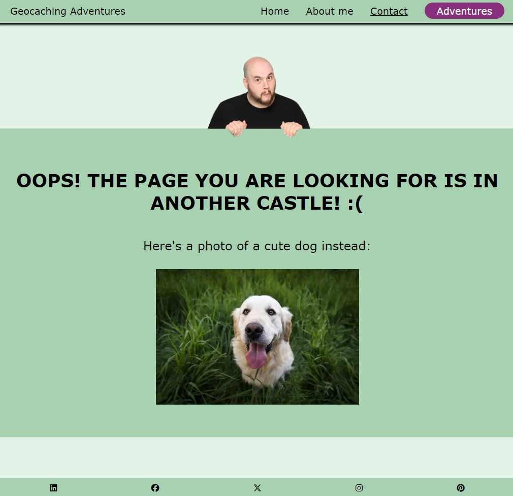
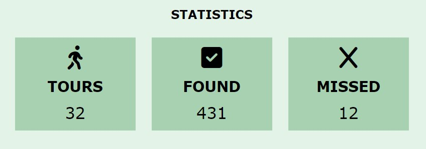

# Geocaching Adventures

Geocaching Adventures is a homepage about one of Dominik Wulf's favourite hobbies. On this page, he shares some XXXXXX pieces of information about the activity and his adventures. The site features four pages.

The live page can be viewed here: [Link to Geocaching Adventures](https://ci-dominik.github.io/pp1-geocaching/index.html "Test")

xxxxxxxxxxxxxxxxxxxxxxxxxxxxxxxxxx [INHALTSVERZEICHNIS] xxxxxxxxxxxxxxxxxxxxxxxxxxxxxxxxxx

## **USER EXPERIENCE**

## Target audience
* DESCRIPTION

## User's journey
* DESCRIPTION

## Intuitive and consistent design
* DESCRIPTION

---

## **FEATURES**

## Site-wide

### Navigation menu
* The navigation menu was designed to attract the users to the adventures page. They should get there as soon as possible to experience the main area of the homepage. In that area, I show photos of two sample adventures and of geocaches I found along the way.
 
There is also an indicator on which page the user is currently. The selected item is underlined.
 
In mobile view (width < 768px / 48rem), the menu becomes a burger menu that is collapsible to reveal the hyperlinks. It was created using a self written JavaScript file.

### Footer
* The footer consists of social media links to LinkedIn, Facebook, X, Instagram and Pinterest. All of those links got an aria label to increase the accessibility for impaired users. Also, every link has a rel attribute of "noopener" to prevent security problems.

### Favicons
* As a favicon, the geocaching logo was used so the user immediately gets the right impression of the content. Icons in different sizes were added to display an icon for every use case. For example as the tab's icon or when the page gets saved as a link on a mobile device.

 

### Contact success page
* DESCRIPTION

### 404 page
* A 404 page was added to inform the user when a page cannot be found. It also features the navigation and footer bar to lead the user back to another page of the site.

---

## Landing page

### Hero image
* DESCRIPTION

### Benefits section
* DESCRIPTION

### Geocaching explanation
*DESCRIPTION

---

## About page

### Author information
* DESCRIPTION

### Geocaching statistics
* DESCRIPTION

### Fun facts
* DESCRIPTION

---

## Adventures page

### Introduction to adventures
* DESCRIPTION

### Sample adventures
* DESCRIPTION

---

## Contact page

### Contact text and form
* DESCRIPTION

---

## **FEATURES EXPLAINED**

## Existing

### Responsive design
* DESCRIPTION

### Interactive dropdown buttons on adventure page
* DESCRIPTION

### Contact form
* DESCRIPTION

## Upcoming

### Connection to a database to pull adventures and images from
* DESCRIPTION

### Auto-adjusting counter for geocaching tours, found geocaches and missed geocaches
* DESCRIPTION

---

## **Design**

## Wireframes

### Landing page

### Adventures page

### About page

### Contact page

---

## **Used technologies**

### HTML
* DESCRIPTION

### CSS
* DESCRIPTION

### JavaScript
* DESCRIPTION

### Visual Studio Code
* DESCRIPTION

### GitHub
* DESCRIPTION

### Adobe Photoshop
* DESCRIPTION

### Fontawesome
* DESCRIPTION

### Favicon generator
* DESCRIPTION

---

## **Testing**

## Responsiveness

### Steps
* DESCRIPTION

xxxxxxxxxxxxxxxxxxxxxxxxxxxxxxxxxx Table xxxxxxxxxxxxxxxxxxxxxxxxxxxxxxxxxx

---

## **Accessibility**

### Lighthouse testing
* Lighthouse testing was used to determine the site's proberties regarding performance, accessibility, best practices and SEO. Special emphasis was layed on performance and accessibility to provide a great user experience for every visitor, no matter the device or conditions. 
The accessibility rating suffered a bit from low contrast due to color choices on the homepage. This matter will be addressed further in the [bugs](#bugs) section.

**Frontpage**

  

**Adventures**

  

The adventures page suffered from file sizing. This will be addressed in the [bugs](#bugs) section.

**About me**

  

**Contact**

  

### WAVE extension (Google Chrome)
* The WAVE extension in Google Chrome was used to spot errors in page design. Some of the homepage's areas suffer from low contrast. This issue will be thought about in the future to discuss a redesign of the used color palette. 
The only other issue was a redundant link to the frontpage in the logo and the navigation bar. As it is common practice to use this approach to web design, I did not address this issue any further. 
The WAVE extension correctly spotted the aria labels that were used for the footer's social media icons. The links also got the rel attribute of noopener to increase website security.

### Manual testing

|Testing method | Expected result | Actual result |
|:-------------:|:---------------:|:-------------:|
|PLACEHOLDER    | PLACEHOLDER     | PLACEHOLDER   |

### Issues and fixes
* DESCRIPTION

---

## **Functional testing**

### Navigation links
* DESCRIPTION

### Contact form
* DESCRIPTION

---

## **Validator testing**

### HTML validator
* DESCRIPTION

### CSS validator
* DESCRIPTION

---

## **Unfixed bugs**

### Bugs
* DESCRIPTION

### Potential fix
* DESCRIPTION

---

## **Deployment**

### Visual Studio Code connection
* DESCRIPTION

### Deployment via Visual Studio Code
* DESCRIPTION

---

## **Credits**

### PicturePeople Leverkusen (photo studio)
* Photos of me shot by **Daria Lipp**

### Fontawesome
* Links to several icons

### YouTube
* Several videos for learning

### Pixabay
* [Jungle photo](https://pixabay.com/de/photos/jungle-bali-wild-dschungel-natur-5046272/) (annawoodie @ Pixabay)
* [Toolbox photo](https://pixabay.com/de/photos/werkzeuge-werkzeugkasten-3411589/) (Steve Sammon @ Pixabay)

### Pexels
* [Hat photo](https://www.pexels.com/de-de/foto/stadt-mann-gebaude-muster-27065154/) (Masud Allahverdizade @ Pexels)
* [Dog photo](https://pixabay.com/de/photos/hund-haustier-tier-niedlich-1839808/) (Pexels @ Pixabay)